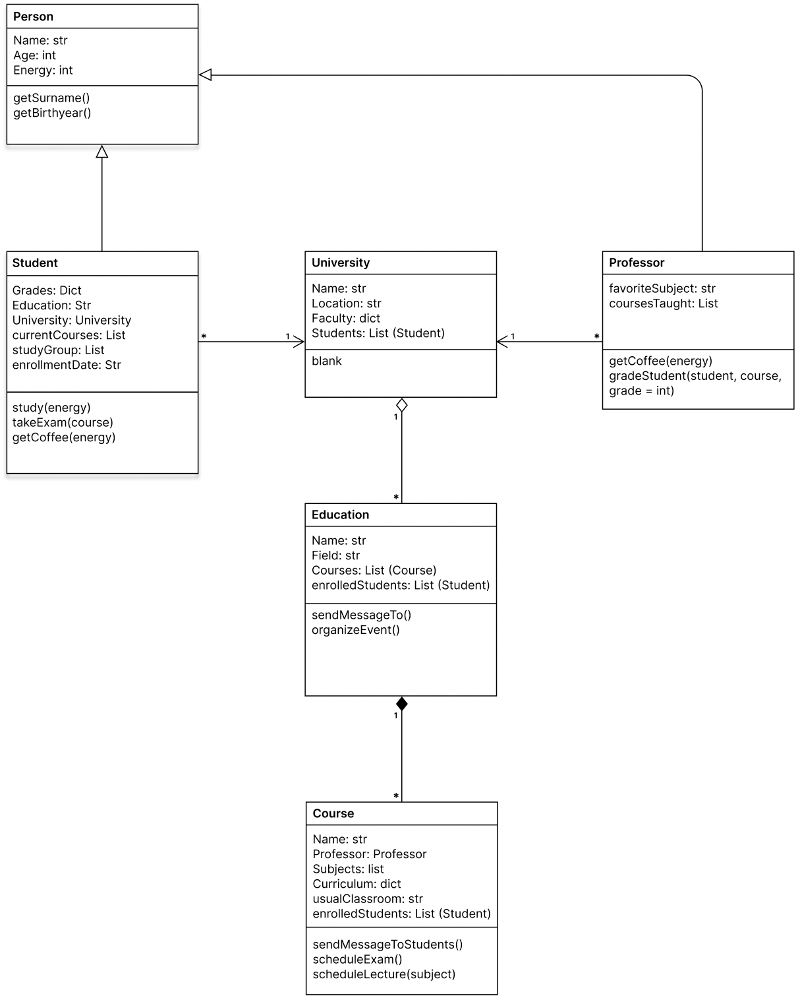

# Assignment 3 - OOD and OOP in Python 3

<p> <strong> By Gabriel Høst Andersen, PFTH, 2022.</strong> </p>

<p> The assignment was done in collaboration with my fellow study group member Lissa van Bui. </p>

<p> Word count (README excl. code blocks + scripts): 11799 </p>

<h2> How to execute </h2>

<p> Ensure that python has been correctly installed. The scripts use modules included in a default python installation. </p>

<p>  Then execute the script (example for win below) </p>

```
python ./class.py
```

  
## Problem 1: Object-Oriented Design

<p> We decided to build our object classes around the context of a 'BA Student'. We decided to start with figuring out the attributes and methods this specific class would have. Thus, by analyzing the desired data and behaviours, we were able to get  an overview of the required classes, and the dependencies between them. Obviously, as will become evident in  our implementation, this is an iterative process,  and we continued adding, removing, and modifying attributes and methods as our analysis became more detailed, and the classes became further interconnected.  </p>

<p> We decided to visualize our OOA using a Class Diagram, which is one of the variety of options that the UML language offers, effectively transitioning to the OOD stage of the process. As the Student and Professor classes share similarities, we decided to position them as subclasses to the Person superclass, using the arrows to signify the inheritance relationship. Both these subclasses share an  association with the university class, as signified by the association arrow. We've attempted to signify the multiplicty as an indefinite amount of Students and Professors belonging to a singular university, with the arrow direction clarifying <strong> many students / professors belong to one university. </strong> Obviously, this is an abstraction of the relationship, as I imagine professors doing e.g. guest lectures, thus garnering an, albeit looser, assocation with other universities. </p>

<p> We decided to position the Education class in an aggregate relationship to the University class, since we imagine an education potentially existing independantly from a university. Yet, we positioned the Course class in an compositive relationship to the Education class, since we generally thought that courses would exists in relation to the education, and the nature of the education would  affect the courses to a larger degree than the university would affect the education.  </p>

<p> Ultimately, as Phillipos (2015) highlights, the distinction between aggregation and composition is often irrelevant in inplementation, and you could easily argue against the choices we made. Whether these distinctions are are merely semantics or not, I hope to have highlighted the thought process behind our design decisions. </p>

<p> The class diagram is depicted below: </p>

<p align="center">
	
</p>

## Problem 2 - Object-Oriented Programming
In order to transition from OOD to OOP, we started implementing our classes in Python. Below i have included an example of the Student class that we diagrammed earlier:

````py
class  Student(Person):

	def  __init__(self, grades, education, university, currentCourses, currentSemester, studyGroup=None, **kwargs):

		super().__init__(**kwargs)

		self.grades = grades

		self.education = education

		self.university = university

		self.currentCourses = currentCourses

		self.currentSemester = currentSemester

		self.studyGroup = studyGroup

	def  study(self, minutes):

		if  self.energy > minutes * 0.5:

			self.energy -= minutes * 0.5

			print(f'You successfully studied for {minutes} minutes, you now have {self.energy} energy left!')

		else:

			print("You're too tired to study! Consider drinking some coffee or getting some sleep :)")


	def  takeExam(self, course):

		try:

			self.currentCourses.remove(course.name)

		except:

			print(f"This is the exam for {course.name}, and you aren't currently enrolled in this course")

		else:

			self.energy -= self.energy

			print(f'Congrats! You completed the exam for {course.name}. Your courses now consist of {self.currentCourses}')

			course.professor.examsToGrade += 1
````

Here, we use the super() function to create the inheritance relationship we highlighted earlier. By using this function, we're able to extend the functionality of the methods we created for the Person superclass. We could've incorporated polymorphism by modifying the Person class's method getCoffee() in the Student or Professor classes. We temporarily instantiate the Superclass with the init dunder method, specifying the keyword arguments, which need to be provided when the Student subclass will be instantiated. We use the arbitrary  arguments **kwargs for increased compatibility, should we decide to modify the keyword arguments used to instantiate the Person class.

We continously ran the script interactively, so we were able to debug and iterate our implementation. We  attempted  to facilitate communication between objects: An example would be the takeExam method. This method requires a Course object instance to be passed as the keyword argument.  In hindsight, we should've checked the type of the argument, to ensure the functionality of the method. We struggled with instantiating  the attributes  with  object instances, since we aimed to instantiate the Student  object instances first in our entry point function, we could conceptualize a setter() method, which would modify the attributes after all object instances had been instantiated. 

Please refer to the [class.py](class.py) file I've uploaded to this github repo to view the code in detail. 

##  Problem 3 -  Instantiate Class using an Entry Point Function

In our entry point function, we started by creating instantiations of our object classes. Then, we aimed to exhibit the functionality of our objects by calling all our methods in appropriate order, and visualizing this by using the print() function. We imported the time module,  in order to create a gradual flow in the representation. 

Please refer to the [class.py](class.py) file to view the code in detail, I've included a snippet of the entry point function and the terminal output below:

````py
educationInstance = Education(

	name = 'Digital Design',

	field = 'Humanities',

	courses = [courseInstance],

	enrolledStudents = [studentInstance, studentInstance2]
)
---------------------------------------------------------------------------------------
studentInstance2.takeExam(courseInstance)

time.sleep(delay)

studentInstance2.takeExam(courseInstance)

time.sleep(delay)

print(f"The professor {professorInstance.name} has {professorInstance.examsToGrade} exams to grade")

time.sleep(delay)

professorInstance.gradeStudent(studentInstance2, courseInstance, 12)

time.sleep(delay)

print(f"The student {studentInstance2.name}'s grades consists of the following {studentInstance2.grades}")
````

Output:

````
Congrats! You completed the exam for IxT. Your courses now consist of ['PFK', 'PFTH']
This is the exam for IxT, and you aren't currently enrolled in this course
The professor German Leiva has 1 exams to grade
The student Victor Rasmussen's exam for the course IxT has been graded!
The student Victor Rasmussen's grades consists of the following {'IxD': 7, 'CoD': 4, 'AP': 10, 'SS': 4, 'IxT': 12}
````


