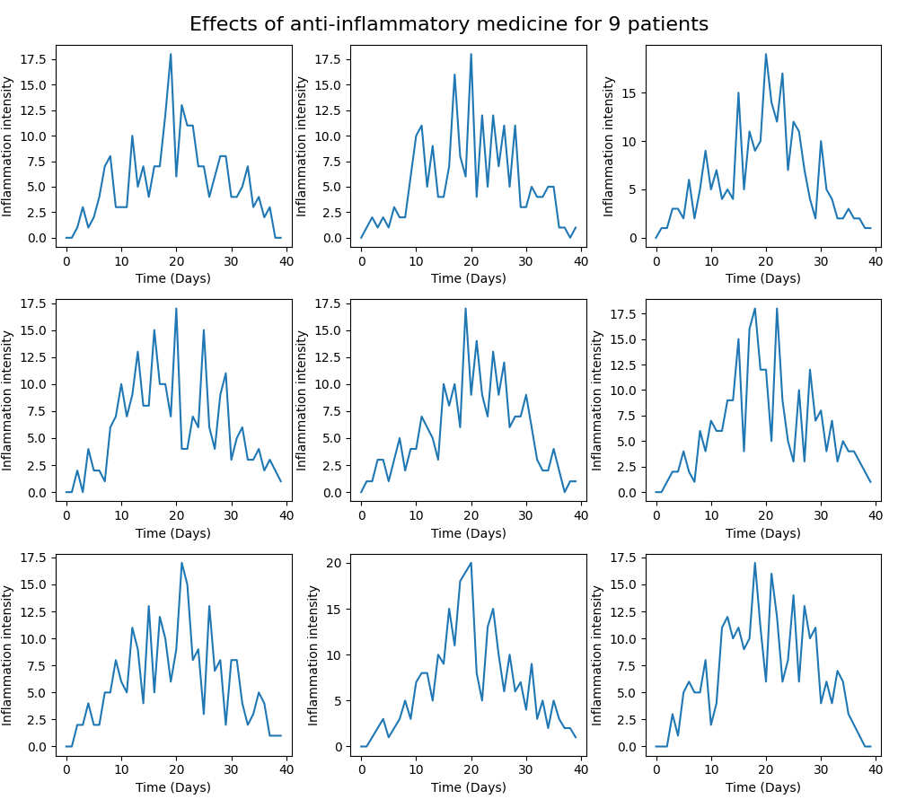

<h1>  Assignment 4 - Data Visualization </h1>

<p> <strong> By Gabriel Høst Andersen, PFTH, 2022.</strong> </p>

<p> Word count (README excl. code blocks + scripts): 9489 </p>

<h2> How to  execute </h2>

<p> Ensure that the dependencies  are correctly installed. </p>

```
pip  install  -r  requirements.txt
```
<p>  Then execute the script (example for win below)

````
python ./dataVisualization.py
````
  
<h2>  Problem 1 - Custom Plotting Function </h2>

<p> In order to tackle the problem, i start by importing my dependencies. I import the entire matplotlib module in order to  style certain parameters later, but keep the specific pyplot import for readability. </p>

````py
import matplotlib as mpl

import matplotlib.pyplot as plt

import numpy as np
````

<p> In order to create a function that can take a series as input,  and output a visualization of said series to a desired filename, I started by creating the function, and defining the parameters. I used an f-string to modify the loadtxt() function's fname keyword argument to accomodate the defined series and fileName parameters.  I also included format as an attempt for greater versatility / ease-of-use. The imshow() method from pyplot visualizes the data as an image, and the saveFig() function saves the current figure to the /figures directory, with the desired filename.</p>

````py
def  createPlottingFunction(series, format, fileName, colorMap='Blues', normScale='linear', title='', xLabel='', yLabel=''):

"""

This function will take a given series, with a given format, and after visualizing the data input in series, it will the visualization

as a PNG file with a given file name.

Please check the following url for cmap documentation: https://matplotlib.org/stable/gallery/color/colormap_reference.html

Please call mpl.scale.get_scale_names() to get availiable scale levels.

title, xLabel and yLabel keyword arguments are empty strings by default, please insert you own if you wish in the function call.

"""

	data = np.loadtxt(fname=f'data/{series}.{format}', delimiter=',')

	plt.imshow(data, cmap=colorMap, norm=normScale)

	plt.title(label = title, pad = mpl.rcParams['axes.titlepad'])

	plt.ylabel(xLabel)

	plt.xlabel(yLabel)

	plt.savefig(f'figures/{fileName}.png')
	
````

<h2> Problem 2 - Modify Figure Properties </h2>

<p> In order to alter the figure properties whilst maintaining the functionality of the createPlottingFunction, I start by ensuring the properties can be altered through arguments in the eventual function call. Title, xlabel and ylabel are empty strings by default, since the function doesn't "need" these to execute. These properties are applied through the syntax below:</p>

````py 
	plt.title(label = title, pad = mpl.rcParams['axes.titlepad']) 
	plt.ylabel(xLabel) 
	plt.xlabel(yLabel)
````

<p> Since the data is visualized through the imshow() function rather than the plot() function, I was unable to manipulate any linewidth, since the property is not present when visualizing a heatmap through imshow(). I attempted to use plot to visualize the series data, but was unable to achieve a  satisfactory result, since the size and variation of the series made it hard to discern the individual patients. Even though it provided an insight into the general tendency / trend through line overlap, the variance made the data hard to grasp visually. Perhaps manipulating the range of the y-axis would've helped. Yet i stuck with the heatmap, as i deemed it a more suited for visualizing this dataset. </p>

<p> Instead of linewidth, I included a parameter to alter the norm property, though only through scale levels, not the Normalize object. I coupled this with the cmap property, which alters the colors that are interpolated between for the visualization. I also altered the padding through altering the global rcParams object from matplotlib as an attempt to enhance readability / aesthetics (in my opinion). The cmap and norm properties are altered in the imshow() function call, it is displayed in the following line:</p>

````py
	plt.imshow(data, cmap=colorMap, norm=normScale)
````

<p> Lastly, I included a docstring to describe the function, and to provide explanations / resources for how to manipulate cmap and norm. </p>

An example of function implementation can  be seen below:
````py
createPlottingFunction(series='series-01', format='csv', fileName='clinicalTrialDataset',
colorMap='bone', title='Effects of anti-inflammatory medicine', xLabel='Patients', yLabel='Time'
````
<p align="center">
	
</p>

<h2>  Problem 3 -  To stack or not to Stack </h2>

<p> In order to compare and reflect upon the advantages/disadvantages of  stacking vs. subplotting series data, I started by creating functions capable of visualizing the intented data. </p> 

<p> For the stacked plot I created the following function: </p>

````py 
def stackedSeriesPlot(series, format, fileName='stackedplot', seriesStart=0, seriesAmount=9):

	data = np.loadtxt(fname=f'data/{series}.{format}', delimiter=',')

	for i in range(seriesStart, seriesAmount):

		plt.plot(data[i, :])

	else: print(f'The following rows have been printed: {seriesStart} to {seriesAmount}')

	plt.title(f'Effects of anti-inflammatory medicine for {seriesAmount} patients', fontsize=16, pad=15)

	plt.ylabel('Inflammation intensity')

	plt.xlabel('Time (Days)')

	plt.savefig(f'figures/{fileName}.png')

````

<p> I have added the seriesStart and seriesAmount parameters for deciding the starting point in the dataset, and the range respectively. I utilized a for loop to inidividually plot the desired rows. I use the [i, :] syntax to grab extract singular rows, with the I signaling which row. If i were to extract columns instead, I would swap the I and the colon. I attempted to simply extract the desired range with this syntax, but struggled to visualize it through plot(). Even though testing the ndarray.shape returned (9, 40), it would only visualize 9 columns per row. Perhaps plot() was unable to use the x progression as an index array after I altered it. In the end, i stuck with the "most straightforward way" (as per matplotlip documentation).  Finally, the figure is saved with the desired filename.   </p>

<p> For the plot with subplots I created the following function: </p>

````py 
def  subplotSeries(series, format, fileName='subplot', seriesStart=0, seriesAmount=9):

	data = np.loadtxt(fname=f'data/{series}.{format}', delimiter=',')

	fig = plt.figure(figsize=(10, 9.0), dpi=300)

	axes = []

	for  i  in  range(seriesStart, seriesAmount):

		axes.append(fig.add_subplot(3, 3, i + 1))

		axes[i].set_ylabel('Inflammation intensity')

		axes[i].set_xlabel('Time (Days)')

		axes[i].plot(data[i, :])

	else: print(f'The following rows have been printed: {seriesStart} to {seriesAmount}. Vizualized in {seriesAmount} subplots')

	fig.suptitle(f'Effects of anti-inflammatory medicine for {seriesAmount} patients', fontsize=16)

	fig.tight_layout()

	plt.savefig(f'figures/{fileName}.png')

	plt.close()

````

<p> Here, I start by creating a figure to visualize any eventual subplots and a list to hold these subplots. I utilize a for loop to append each subplot to the list, with each subplot containing 3 rows, 3 columns, and the index going up for each iteration of the loop. Lastly, I plot the data, and another iteration initiates until the index reaches the indicated amount. I attempted to use the ennumerate() function with a break statement to partially iterate through the ndarray , but struggled with the visualization after specifying the dtype as int, so I stuck to using ragne().  </p> 

<p> After the completion the function titles the overall plot with the suptitle() method, adjust the subplots to fit in the given area with the tight_layout() method, and saves the figure to the desired fileName. </p>

<p> The output of the functions can be seen below: </p>

<p align="center"> 
	
</p>

<p align="center">
	
</p>

<p> The most obvious advantage in the stacked plot is the ease of analyzing and comprehending the general trend of the dataset with a simple eye-test. However, I assume this mostly rings true for sets with reasonably statistical similiarity. I think it would great for easily conveying a general trend, say, for a presentation (know your audience), but any direct comparison between the e.g. row 1 and 7 is almost impossible in this visual rendition, since the stacking inherently makes it hard to discern individual differences in datasets. </p>

<p> The subplots create an overview, enabling one to better grasp the the trajectories of the individual patients (datasets). Due to the differences in y-axis, it is fairly easy to identify patient index 7 as the max value, since the subplots by default have their axes adjusted accordingly, the range is somewhat easy to grasp. I find this method to be most advantageous for comparatively analyzing e.g. different solutions to a problem, whilst the stacked plot would be most advantageous for quickly converying the general trend of the datasets. </p>

<p> Another disadvantage of the subplots is its medium. Since there's 9 distinct plots, it's harder to scale it down, while maintaining its readability, thus it is sub-optimal for small screen readers or a scientific journal with limited space. </p> 

