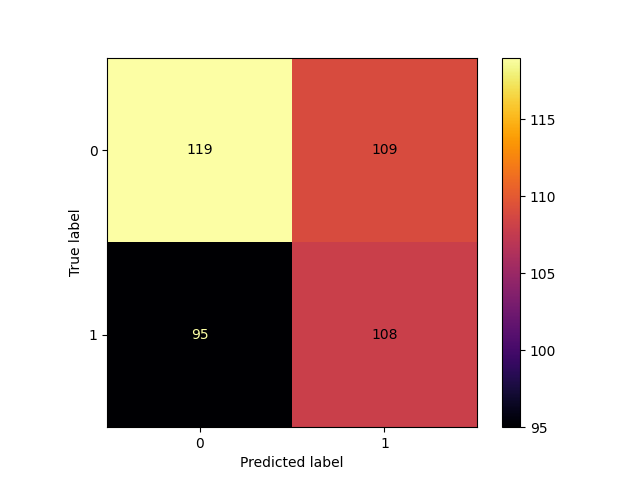
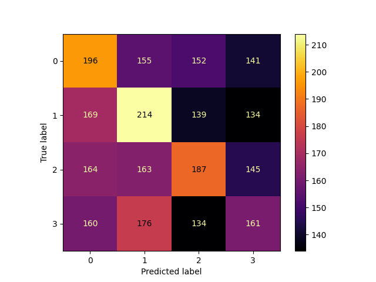
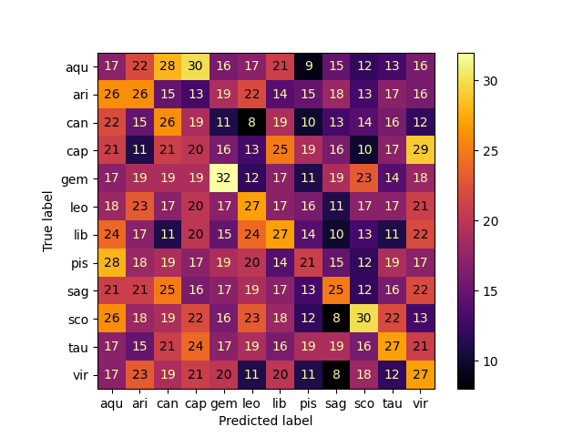

<h1>  Assignment 5 - Horoscope Classification with scikit-learn </h1>

<p> <strong> By Gabriel Høst Andersen, PFTH, 2022.</strong> </p>

<h2> How to  execute </h2>

<p> Ensure that the dependencies  are correctly installed. </p>

```
pip  install  -r  requirements.txt
```
<p>  Then execute the script (example for win below)

````
python ./binaryClassificationModel.py
````

<h2>  Problem 1 - Binary classification </h2>

<p> I've made a complete problem solution in modelClassification.py, whilst having a seperate script for each problem in the individualScripts directory. </p>

<p> Please refer to binaryClassificationModel.py for the problem solution. Included code comments. I have also included the results  below for discussion/reflection purposes:

````
PS C:\Users\Gabriel\Documents\GitHub\PFTH\assignment_5> python .\binaryClassificationModel.py
The confusion matrix has been visualized and saved in the figures folder.
Relative Accuracy: 0.5266821345707656
Accuracy in instances (True positives + True negatives): 227
Cross-validation mean score: 0.5385670116951203
Cross-validation standard deviation: 0.0417067984155106
Performance difference from zero rate: 0.039
That correlates to a 7.7% relative change
````

For the sake of comparison, I have  determined the baseline (Zero Rate) as 50% per the problem specification. I have compared this to the mean from the performed cross-validation, since it  more accurately depicts the model's performance,  due to (at least  somewhat) minimizing the element  of randomness. 

The model is  "only" marginally more accurate than a simple coin  toss / predicting the same sign every  time. It correctly predicted the sign in 227 instances, which corresponds to a relative accuracy of  52.7% for the seed i arbitrarily chose. The cross-validation mean score was 53.9%, although with quite a high standard deviation. All  in all, the model is theoretically 3.9% more likely to predict the correct sign than the baseline accuracy, which correlates to  a relative performance boost of 7.7% between the two  accuracies. 

Based on  the performance of the model, one can conclude that it is hard  to generalize / define a horoscope as belonging to a specific zodiac  sign, perhaps due to a lack of individualization of horoscopes, or perhaps due to a lack of defining/consistent keywords for each sign. One can imagine horoscopes as beong generally vague, in order to take advantage of various cognitive biases, e.g. confirmation bias, to increase credibility (and thus profit). Under this  assumption, horoscopes are  incentivized to trend towards  generalization between the zodiac signs. Lastly, horoscopes  are  assumedly oftentimes  targeted towards an  average demographic, which means focusing on events relating to the experience of being human. If one assumes that the variying  zodiac signs are  NOT  deterministically/essentialistically destined towards certain events  specific to their sign, one has to work under the  assumption, that most experiences generally pertaining to being human will occur for each sign. This assumption inevitably necessitates overlap between the horoscopes, making it harder to classify.  In conclusion, it is hard to classify a given horoscope from the dataset as belonging to a specific sign.

Whilst writing the code, I found that merely  using  print() to visualize the confusion matrix was quite detrimental to  my comprehension, so I attempted to visualize it. The result can be seen below:

<p align="center">
	
</p>


<h2> Problem 2 - Effects of  preprocessing </h2>

Please refer to preprocessedClassificationModel.py for the problem solution. I have also included the results  below for discussion/reflection purposes:

````
PS C:\Users\Gabriel\Documents\GitHub\PFTH\assignment_5> python PS C:\Users\Gabriel\Documents\GitHub\PFTH\assignment_5> python .\preprocessedClassificationModel.py
Results from model without preprocessing:
Relative Accuracy: 0.5266821345707656
Accuracy in instances (True positives + True negatives): 227
Cross-validation mean score: 0.5385670116951203
Cross-validation standard deviation: 0.0417067984155106
Performance difference from zero rate: 0.039
That correlates to a 7.7% relative change

Results from model with preprocessed dataset
Relative Accuracy: 0.5197215777262181
Accuracy in instances (True positives + True negatives): 224
Cross-validation mean score: 0.5391484070439574
Cross-validation standard deviation: 0.0454914988037896
Performance difference from zero rate: 0.039
That correlates to a 7.8% relative change
````

As depicted above,  I was unable to  meaningfully improve the accuracy of the model with preprocessing. I attempted to prune the document-term matrix created  by  CountVectorizer's  fit_transform method by using various stopword lists, max_df (limiting the  most often occuring  words) and min _df (limiting the  least occuring words). Although without much success, I'd say it speaks to the difficulty of generalizing and classifying horoscopes. 

In order to further  test this  claim, I wanted to look at the performance if the model were to predict the zodiac element (Professor  Nielbo mentioned this idea during a lesson). Please refer to zodiacElementClassificationModel.py for the solution. I've included the results  below:
````
PS C:\Users\Gabriel\Documents\GitHub\PFTH\assignment_5> python .\zodiacElementClassificationModel.py
The confusion matrix has been visualized and saved in the figures folder.
Relative Accuracy: 0.29266409266409266
Accuracy in instances (True positives + True negatives): 758
Cross-validation mean score: 0.3015651054781489
Cross-validation standard deviation: 0.014026653850218791
Performance difference from zero rate: 0.052
That correlates to a 20.6% relative change
````

In order to test the zodiac element classification, I created an altered copy of the horoscopes dataset, changing each  sign to their corresponding element. For this problem, I've assumed a baseline accuracy  of 25%. Here, we see an increase in performance (relative to baseline), compared to the binary classification model. This could mean, that signs belonging to the same element are comparatively more similiar than signs belonging to other elements. Yet the performance is still  quite mediocre, again speaking  to the difficulty of classifying horoscopes, even when  only attempting to classify the element.

<p align="center">
	
</p>

<h2>  Problem 3 -  Multilabel Classification </h2>

Please  refer to multiClassificationModel.py for the problem solution. Results included below:

````
PS C:\Users\Gabriel\Documents\GitHub\PFTH\assignment_5> python .\multiClassificationModel.py
The confusion matrix has been visualized and saved as confusion_matrix_multi in the figures folder.
Zero Rate accuracy: 0.084
Relative Accuracy: 0.118
Accuracy in instances (True positives + True negatives): 305
Cross-validation mean score: 0.1098884598884599
Cross-validation standard deviation: 0.006291534326526964
Performance difference from zero rate: 0.026
That correlates to a 30.8% relative change
````

I used multiclass classification, rather than multi-label classification, since I deemed it more fitting. Interestingly, this model has the  best performance relative to the  assumed baseline accuracy,  though obviously not the best  absolute performance change. Since this model utilizes the entire dataset,  it has been trained on  a  larger amount of data, which could explain the cause of its relatively substantial performance increase. Shortened display labels for readability in the confusion matrix. 

<p align="center">
	
</p>