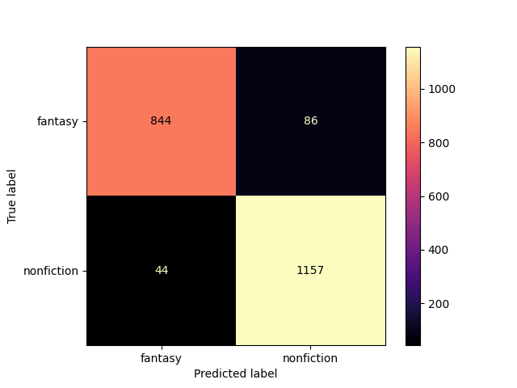

<h1> Individual project - An examination of books</h1>
<p> <strong> By Gabriel Høst Andersen,  PFTH, 2022  </strong> </p>
<h2> How to execute </h2>
<p> Ensure that the dependencies  are correctly installed. </p>

```
pip  install  -r  requirements.txt
```
<p>  Then execute the script (example for win below) </p>

````
python ./word_importance.py
````

<h2>  Problem  specification  </h2>

<p> For my final project, I wanted to explore data  pertaining  to one  of my favorite hobbies: Reading.  Throughout my project, I will be focusing on word importance (NLP) and machine learning, specifically modeling a linear regression model and a multiclass classification model, with supplementary data visualization complementing these primary focus points. </p>

<p> I used a  dataset containing 100.000 book entries from the site Goodreads, sourced from  kaggle. The dataset can be sourced through the link in the references. </p>

<p> Throughout this project,  I will be working with csv format datasets. I've attempted to incorporate modular programming in  my project by creating the csv_func.py file, which is intended to be a module for altering/getting/manipulating csv files. </p>

<p> Please refer to the py scripts for the full problem solution.  Code blocks included in readme for discussion/reflection purposes.  </p>

 <h2> Problem 1 - What defines a genre? </h2>

<p> For this problem, I wanted to explore what defines a genre. I attempted to create an abstraction of book genres by looking at the most frequently occuring words of book descriptions pertaining to that specific genre. Furthermore, I wanted to explore relationships/correlations between genres by looking at the intercept between top words for differing genres. </p>

<p> Goodreads defines a book genre by  way of democracy; Books  are delegated multiple genre labels based on popularity vote. In the dataset, the genres are sorted by popularity (user votes). This creates a potential bias in the dataset, since less popular books' genres are less likely  to be properly defined (defining a book's genre(s) is a whole problem in itself). </p>

<p> Since the dataset's genre column contains a string with all the genres, I need to tokenize the genres. I accomplish this through importing the pruning_csv function from my make-shift module. Afterwards, I make use of the functions  provided by professer Nielbo for our 2nd assignment to process the retrieved data. I incorporate these functions in to my get_top_words_for_genre  function. I decided to include all books which contained  the genre. Alternatively, I could've looked only at books with the genre as its top genre. </p>

<p> In order to showcase the functionality of my script, I create an entry-point function where I compare 2 assumedly similiar genres, and 2 assumedly dissimiliar genres. The results can be seen below:

````
[RESULTS] The top 100 most frequent words occuring in book descriptions for books belonging to the fantasy genre can be seen below:
['life', 'time', 'book', 'love', 'find', 'story', 'man', 'years', 'magic', 'series', 'dark', 'young', 'finds', 'human', 'war', 'family', 'death', 'power', 'stories', 'people', 'secret', 'save', 'mysterious', 'ancient', 'city', 'dead', 'woman', 'heart', 'evil', 'friends', 'long', 'vampire', 'night', 'day', 'tale', 'things', 'girl', 'work', 'adventure', 'place', 'king', 'author', 'lives', 'men', 'set', 'powerful', 'fantasy', 'tales', 'earth', 'dangerous', 'true', 'great', 'battle', 'magical', 'friend', 'future', 'strange', 'secrets', 'lost', 'history', 'good', 'father', 'romance', 'face', 'takes', 'beautiful', 'mate', 'discovers', 'readers', 'fight', 'boy', 'town', 'left', 'school', 'land', 'powers', 'thing', 'house', 'blood', 'journey', 'discover', 'bestselling', 'living', 'short', 'finally', 'truth', 
'york', 'mother', 'hell', 'times', 'protect', 'live', 'real', 'worlds', 'high', 'order', 'black', 'mystery', 'books', 'deadly']

[RESULTS] The intersection between Fantasy and Science Fiction can be seen below:
['friends', 'friend', 'true', 'order', 'fight', 'magic', 'man', 'tale', 'truth', 'strange', 'father', 'time', 'high', 'human', 'woman', 'secret', 'earth', 'stories', 'long', 'lives', 'people', 'heart', 'discover', 'black', 'left', 'york', 'find', 'journey', 'short', 'life', 'future', 'mysterious', 'city', 'save', 'story', 'love', 'lost', 'battle', 'adventure', 'things', 'history', 'ancient', 'author', 'evil', 'great', 'work', 'discovers', 'secrets', 'finds', 'place', 'living', 'book', 'men', 'takes', 'series', 'power', 'live', 'war', 'young', 'family', 'powerful', 'years', 'dangerous', 'deadly', 'face', 'death', 'dead', 'worlds', 'dark', 'set', 'fantasy', 'girl', 'day']

[RESULTS] The intersection between Fantasy and Nonfiction can be seen below:
['true', 'books', 'man', 'human', 'time', 'stories', 'long', 'lives', 'people', 'york', 'find', 'journey', 'life', 'story', 'love', 'times', 'history', 'ancient', 'author', 'great', 'work', 'place', 'takes', 'book', 'men', 'power', 'series', 'war', 'readers', 'young', 'family', 'good', 'years', 'worlds', 'day']
````

<p> My hypothesis surrounding similiarity/dissimilarity  ended up largely correct. Looking at the top 100 words for the fantasy genre: Interestingly, it contains words such as 'magic', which one would deem, in my subjective opinion, essential to the fantasy genre,  whilst also containing meta words such as 'bestselling', 'series' and 'books'. Alternatively, these meta words could've been included in the stopword list,  in order to more accurately depict top words and intersections. </p>

<p> In order to better illustrate the genre  intercepts, I visualize the intercept data through a simple venn diagram. The venn diagrams depict the overlap and the difference. Had I done a larger sample of genres, I might 've deemed  a bar  chart depicting the  length  of the list of  intercept words a more appropriate data visualization. I mainly chose venn diagrams for their simplicity, and their ability to convey easily-gleamable correlations quickly. The visualizations can be  seen below: </p>

<p align='center'>
    
    
</p>

<h2> Problem 2 - Exploration through linear regression modeling </h2>

<p> I feel the need to preface this section by clarifying that my intent behind utilizing a linear regression model to examine various data correlations was primarily exploratory.  In this section, I'll be briefly touching upon each model I trained. Throughout the various models, I refraining from removing any  outliers from the datasets. Ordinary least squares model  was  used for all regressions.</p>

<p> Continuing along the vein  of NLP and  word importance, I wanted to explore whether including  the most genre-defining words in a books description would improve its popularity or its rating. I created a  function get_frequency_top_words, which counts the amount of occurances of items from List 1 (top words)  in List 2 (description from book within genre). I tested both popularity (through total ratings) and avg. rating score, treating these as the dependant variable, and the top word occurances as the independant variable, and the results were quite poor. Already from the initial scatter plot, you'd be able to deduce a non-linear correlation between the data.  The regression actually ends up depicting a negative correlation, which is evidenced by the slope / coefficient. Yet, as previously stated, my intent behind this model is  explatory. The results and visualization can be  seen below:  </p>

````
---Printing results for Rating vs. Top word occurances---
[RESULTS] Coefficients: [[-0.05637524]]
[RESULTS] Mean squared error: 1.0182000870919834
[RESULTS] Coefficient of determination (r2): 0.0030699127539238757
[RESULTS] 10 K-fold cross validation mean: 0.002516043586623329   
[RESULTS] 10 K-fold cross validation standard deviation: 0.0028597612090568024
````

<p align='center'>
    
</p>

<p> Throughout the creation of the linear regression model, I  largely followed professor Nielbo's example for relaying model results and standardization, which can be seen in the terminal output and the figure's axes. </p>

<p> Secondly, I wanted to explore the relationship between page count and price, i.e. whether price is dependant on page count, and whether it the relationship is linearly scalable.  Since my dataset from goodreads didn't contain pricing, I used a dataset containing data science textbooks, scraped from Amazon. This dataset comes with some caveats though: The sample  size is quite small, at least comparatively, and since it's the most popular textbooks, this might skew the price, and lastly, since they're textbooks, the price might depend  largely on the level/specificity  of knowledge provided. These factors all contribute to potential bias in the dataset. The results and visualization can be  seen below: </p>

````
---Printing results for Price vs. Pages---
[RESULTS] Coefficients: [[0.46779576]]
[RESULTS] Mean squared error: 0.8513810751270253
[RESULTS] Coefficient of determination (r2): 0.143600929483777
[RESULTS] 10 K-fold cross validation mean: 0.17700278514529116
[RESULTS] 10 K-fold cross validation standard deviation: 0.12316055431008976
````
<p align='center'>
    
</p>
<p> Lastly, I wanted to examine the relationship  between written reviews and total ratings (rated by stars). After initially plotting the data, I was able to recognize a clear trend / a linear relationship. The results and visualization can be  seen below: </p>

````
---Printing results for Total Ratings vs. Reviews---
[RESULTS] Coefficients: [[0.85801996]]
[RESULTS] Mean squared error: 0.28858765201611797
[RESULTS] Coefficient of determination (r2): 0.7848982303477586
[RESULTS] 10 K-fold cross validation mean: 0.7061883616490954
[RESULTS] 10 K-fold cross validation standard deviation: 0.08649279240669282
````

<p align='center'>
    
</p>

Based on the r2-score, which indicates how well the independant value determines / explains the  the dependant value, we can conclude that this regression best fits the data, at least  comparatively  when considering the previous  regressions. In this context, I would deem an r2-score of 0.78 as a relatively high correlation, even whilst considering relatively low variance in the data.

<h2> Problem 3 - Multiclass classification of genre </h2>
<p> For this problem, I considered doing a multilabel classification with multiple genres per. book, yet I settled on multiclass classification based on the  books' top genre using  a naive bayes classifier. The results can be seen below.  </p>

````
---Printing results for binary classification between fantasy and science fiction genres---
[RESULTS] Relative Accuracy: 0.8469617404351087
[RESULTS] Cross-validation mean score: 0.8420571846167899
[RESULTS] Cross-validation standard deviation: 0.013969261174874462
[INFO] The confusion matrix has been visualized and saved in the figures folder as binary_fantasy_science_fiction.png.

---Printing results for binary classification between fantasy and nonfiction genres---
[RESULTS] Relative Accuracy: 0.9389957766306898
[RESULTS] Cross-validation mean score: 0.938262910798122
[RESULTS] Cross-validation standard deviation: 0.008368799751162398
[INFO] The confusion matrix has been visualized and saved in the figures folder as binary_fantasy_nonfiction.png.

---Printing results for multiclass classification of 36 top occuring genres---
[RESULTS] Relative Accuracy: 0.3425222967494656
[RESULTS] Cross-validation mean score: 0.3461769934236206
[RESULTS] Cross-validation standard deviation: 0.005017974815902133

Prediction of Brandon Sanderson's 'The Final Empire' based on its description:

[RESULTS] The predicted genre for your description is ['fantasy']
````

<p align='center'>
     
    
</p>


<p> The models are quite impressive, especially the multiclass  when considering a baseline of  0.03.  The binary classifications strengthen the hypothesis garnered from the initial word importance,  namely the relationship between fantasy and science  fiction. For the multiclass I located the genres with more than 500 occurances to avoid unnecessarily bloating the model.</p> 
<p> Lastly, I wanted to incorporate control flow  by enabling a user to write / input their  own description, which would then be predicted by  the multiclassification model. I  included an example from one of my favorite authors above.  </p> 
<h2>  References </h2>

<span> Manav Dhamani - GoodReads 100k books; An Extensive GoodReads Dataset containing 100k books. </span>
<a> https://www.kaggle.com/datasets/mdhamani/goodreads-books-100k </a>

<span> Iron486 - Amazon Data Science Books Dataset; Amazon most popular science books </span>
<a> https://www.kaggle.com/datasets/die9origephit/amazon-data-science-books </a>